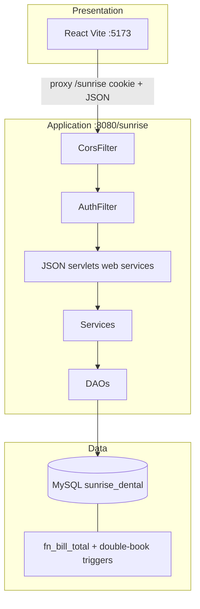

# 4.1 Architecture (three-tier)

```mermaid
flowchart TB
    subgraph presentation [Presentation]
        UI["React Vite :5173"]
    end
    subgraph application [Application :8080/sunrise]
        Cors["CorsFilter"]
        Auth["AuthFilter"]
        Servlets["JSON servlets web services"]
        Services["Services"]
        DAOs["DAOs"]
        Cors --> Auth --> Servlets --> Services --> DAOs
    end
    subgraph data [Data]
        DB[("MySQL sunrise_dental")]
        Rules["fn_bill_total + double-book triggers"]
        DB --- Rules
    end
    UI -->|"proxy /sunrise cookie + JSON"| Cors
    DAOs --> DB
```

Packages: `com.sunrise.model`, `.dao`, `.service`, `.web`, `.util`.
