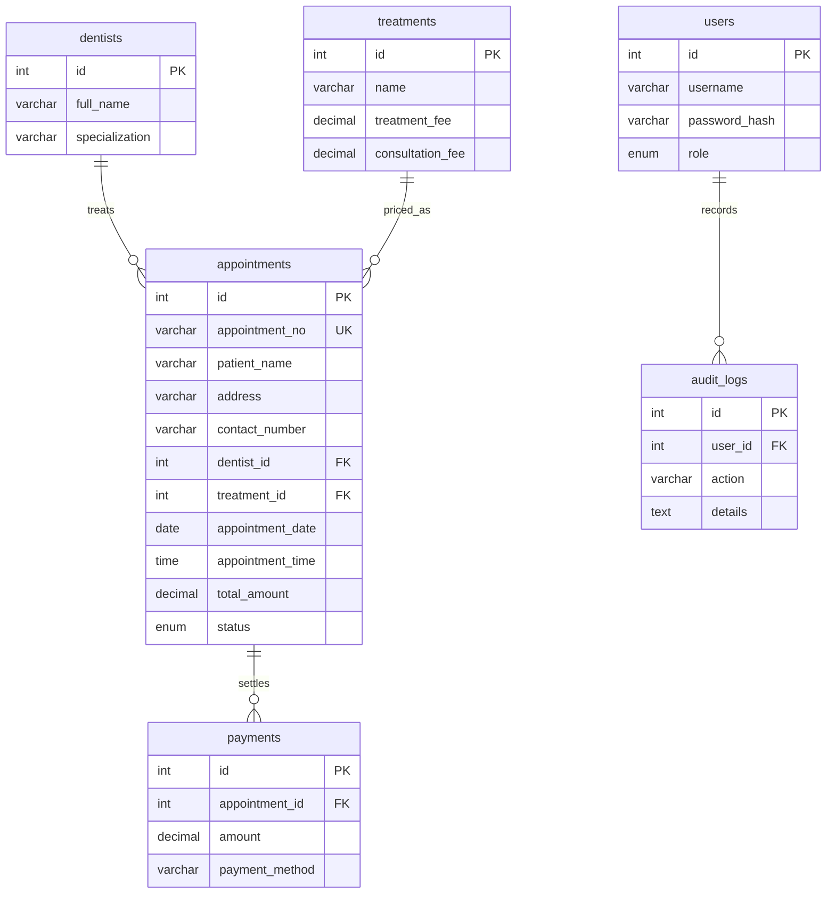

# 4.2 Entity-relationship diagram

**Assumption:** patient details live on the appointment row (as the brief lists them with the visit), not a separate patient table, to keep registration on one form.

**Business rules in MySQL (excellent-band Task B):** `fn_bill_total` recomputes `total_amount` on insert/update; `BEFORE INSERT` / `BEFORE UPDATE` triggers reject a second `SCHEDULED` row for the same dentist, date and time. The Java service still checks first so the UI can show a 409 message instead of a raw SQL error.
