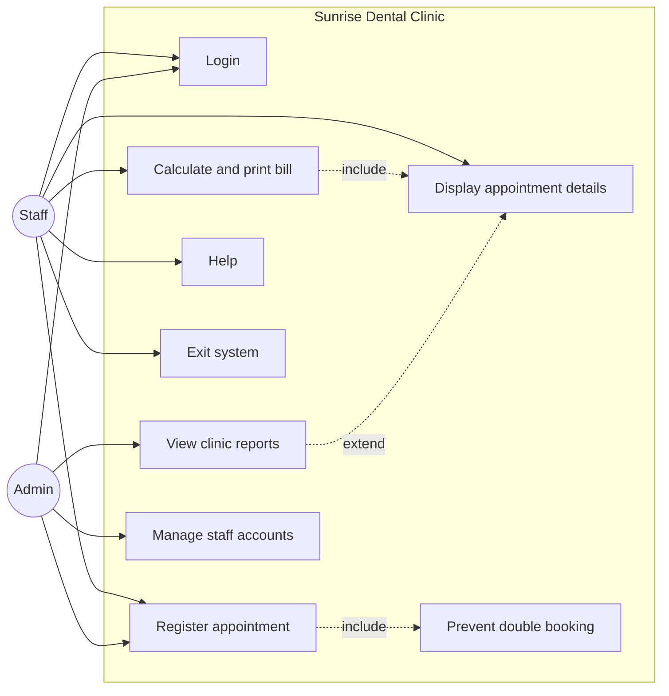
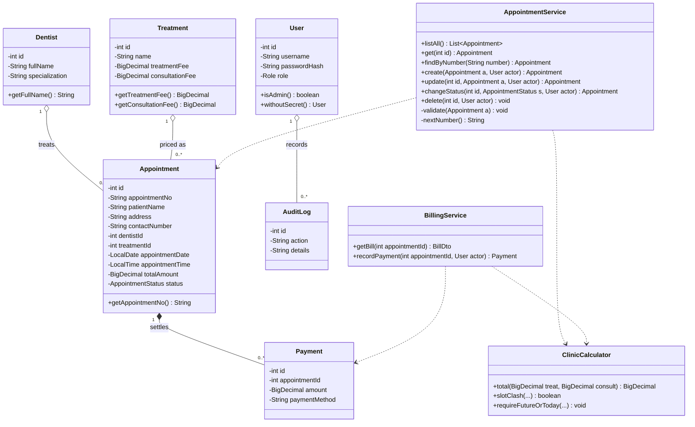
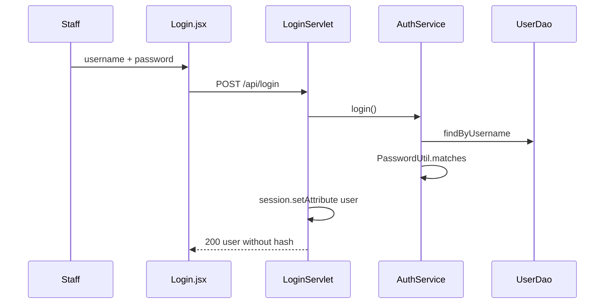
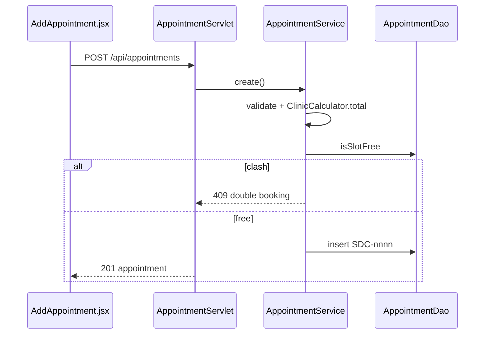
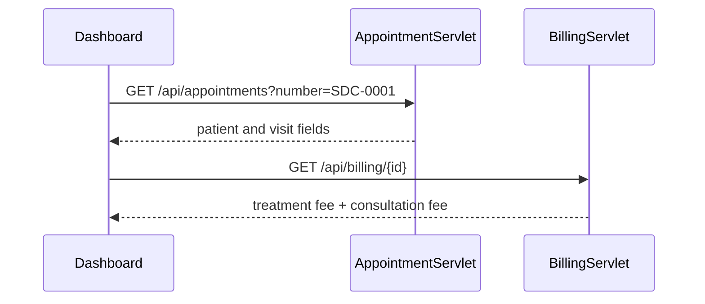

# 4.3 UML diagrams (Task A — 20 marks)

Assumptions: reception **Staff** and **Admin** are actors; guests do not self-book; **Exit** is logout.

## Use case

- `<<include>>` Register appointment always checks the dentist slot.
- `<<include>>` Billing needs the appointment record.
- `<<extend>>` Admin reports optionally drill into a visit.

## Class diagram (core)

Visibility: `-` private, `+` public. Multiplicity and navigability are shown on associations. **Composition** (`*--`): a payment cannot exist without its appointment (deleted with the visit). **Aggregation** (`o--`): dentists and treatments exist independently of any one visit. **Navigability** arrows: an appointment knows its dentist and treatment; a dentist does not hold a list of appointments in memory (loaded via DAO).

Assumption: patient name, address and phone sit on `Appointment` (the brief lists them with the visit), not a separate Patient class. That keeps registration as one use case and one form.

## Sequence — login

## Sequence — register appointment

## Sequence — search and bill

## Design justification

Use cases map 1:1 to the six brief functions plus anti-double-booking (the problem stated in the scenario). Sequence diagrams cover login, register, and display/bill — three identified use cases as the marking scheme asks.
